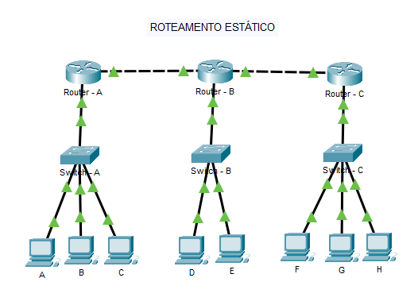
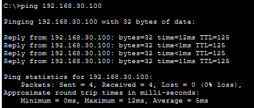

# 🌐 Laboratório de Roteamento Estático Corporativo

Este projeto demonstra a implementação de uma infraestrutura de rede corporativa multi-setorial segmentada logicamente por VLANs, com roteamento de borda configurado de forma totalmente estática e manual (`ip route`) interligando três localidades principais.

---

## 🗺️ Topologia da Rede



---

## 📈 Planejamento de Endereçamento IP (VLSM por Localidade)

O projeto utiliza três redes principais distintas, com escopos fatiados de forma cirúrgica utilizando Máscaras de Tamanho Variável (VLSM) para mitigar o desperdício de endereços:

### 🔗 Redes de Trânsito (Backbone Ponto a Ponto)
Os links que conectam os roteadores de borda entre si utilizam a máscara **`/30` (255.255.255.252)**. Esta configuração é o padrão absoluto da indústria para redes de trânsito ponto a ponto, pois libera exatamente 2 endereços IP válidos por enlace, eliminando qualquer desperdício de escopo IPv4 no backbone corporativo:
* **Link Roteador A ↔ Roteador B:** Rede `10.0.0.0/30` (IPs úteis: `.1` e `.2`)
* **Link Roteador B ↔ Roteador C:** Rede `10.0.0.4/30` (IPs úteis: `.5` e `.6`)

### Roteador "A" (esquerdo): Rede `192.168.10.0`

| Setor / VLAN | Hosts | Máscara / CIDR | Salto | Rede / Broadcast | Gateway | IPs Válidos (PCs) |
| :--- | :---: | :--- | :---: | :--- | :---: | :--- |
| **TI** - VLAN 10 | 50 | `255.255.255.192` (/26) | 64 | `.0` / `.63` | `.1` | `.2` até `.62` |
| **Vendas** - VLAN 20 | 20 | `255.255.255.224` (/27) | 32 | `.64` / `.95` | `.65` | `.66` até `.94` |
| **RH** - VLAN 30 | 10 | `255.255.255.240` (/28) | 16 | `.96` / `.111` | `.97` | `.98` até `.110` |

### Roteador "B" (meio): Rede `192.168.20.0`

| Setor / VLAN | Hosts | Máscara / CIDR | Salto | Rede / Broadcast | Gateway | IPs Válidos (PCs) |
| :--- | :---: | :--- | :---: | :--- | :---: | :--- |
| **Central Atend.** - VLAN 10 | 15 | `255.255.255.224` (/27) | 32 | `.0` / `.31` | `.1` | `.2` até `.30` |
| **Centro Distrib.** - VLAN 20 | 5 | `255.255.255.240` (/28) | 16 | `.32` / `.47` | `.33` | `.34` até `.46` |

### Roteador "C" (direito): Rede `192.168.30.0`

| Setor / VLAN | Hosts | Máscara / CIDR | Salto | Rede / Broadcast | Gateway | IPs Válidos (PCs) |
| :--- | :---: | :--- | :---: | :--- | :---: | :--- |
| **Setor Financeiro** - VLAN 10 | 50 | `255.255.255.192` (/26) | 64 | `.0` / `.63` | `.1` | `.2` até `.62` |
| **Setor Operacional** - VLAN 20 | 20 | `255.255.255.224` (/27) | 32 | `.64` / `.95` | `.65` | `.66` até `.94` |
| **Almoxarifado** - VLAN 30 | 10 | `255.255.255.240` (/28) | 16 | `.96` / `.111` | `.97` | `.98` até `.110` |

---

## 💻 Configurações na CLI (Subinterfaces & Tabelas de Roteamento)

### 🔌 1. Ativação do Gateway Inter-VLAN (Exemplo Roteador "A")
Comandos cruciais utilizados para ativar o entroncamento (*Router-on-a-Stick*) através do protocolo dot1Q:

```text
interface GigabitEthernet0/0.10
 encapsulation dot1Q 10
 ip address 192.168.10.1 255.255.255.192

interface GigabitEthernet0/0.20
 encapsulation dot1Q 20
 ip address 192.168.10.65 255.255.255.224

interface GigabitEthernet0/0.30
 encapsulation dot1Q 30
 ip address 192.168.10.97 255.255.255.240
```

### 🏷️ 2. Configuração de Trunking nos Switches (IEEE 802.1Q)
Para suportar o tráfego de múltiplas VLANs trafegando simultaneamente pelo mesmo cabo físico até o roteador, a porta de uplink do switch principal foi configurada explicitamente em modo tronco (*Trunk*):
```text
interface GigabitEthernet0/1
 switchport mode trunk
```

### 🛣️ 3. Comandos de Roteamento Estático (`ip route`)
Para otimização da tabela de roteamento e redução de overhead, foi aplicada a técnica de **Sumarização de Rotas (Classless/24)**. Em vez de declarar cada sub-rede individualmente, os roteadores apontam para o bloco cheio de cada localidade através dos próximos saltos (*Next-Hop*):

**No Roteador "A" (esquerdo):**
```text
ip route 192.168.20.0 255.255.255.0 10.0.0.2
ip route 192.168.30.0 255.255.255.0 10.0.0.2
```

**No Roteador "B" (meio):**
```text
ip route 192.168.10.0 255.255.255.0 10.0.0.1
ip route 192.168.30.0 255.255.255.0 10.0.0.6
```

**No Roteador "C" (direito):**
```text
ip route 192.168.10.0 255.255.255.0 10.0.0.5
ip route 192.168.20.0 255.255.255.0 10.0.0.5
```

---

## 🧪 Validação e Testes de Conectividade

Para validar a convergência das tabelas de rotas e o correto funcionamento do ecossistema, foi realizado um teste de conectividade ICMP (Ping) atravessando toda a infraestrutura física e lógica do laboratório.

### Escopo do Cenário de Teste:
* **Origem:** PC "A" (Departamento de TI) | IP: `192.168.10.10`
* **Destino:** PC "H" (Almoxarifado) | IP: `192.168.30.100`
* **Encaminhamento Estático:** O tráfego partiu da rede local do Roteador "A". Com base nas tabelas manuais configuradas via comando `ip route`, o roteador identificou o bloco de destino `192.168.30.0/24`, encaminhou o pacote para o Roteador "B" (próximo salto) através do backbone ponto a ponto, sendo entregue com sucesso à VLAN correspondente no Roteador "C".

Abaixo, a evidência do terminal comprovando 100% de sucesso na comunicação (0% de perda de pacotes):



## 🔄 Evolução deste Laboratório: Roteamento Dinâmico

Embora o roteamento estático com VLSM seja extremamente seguro e eficiente para redes de pequeno porte, ele se torna complexo de gerenciar manualmente à medida que a infraestrutura corporativa cresce e ganha novos caminhos redundantes.

Para analisar como automatizar a descoberta de redes e acelerar o tempo de convergência em larga escala, acesse a evolução deste projeto com o protocolo OSPF:
👉 **[Acessar Laboratório 02: Roteamento Dinâmico (OSPF)](../02-roteamento-dinamico-ospf/)**
