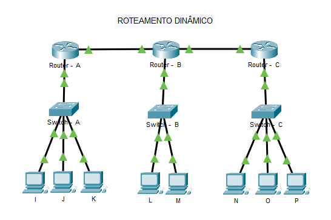
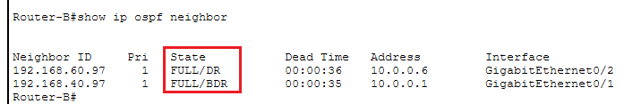
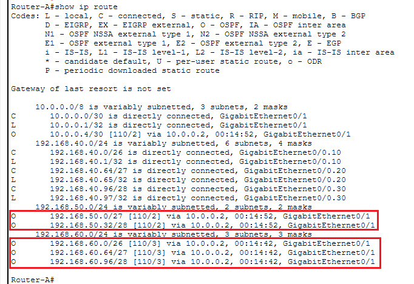
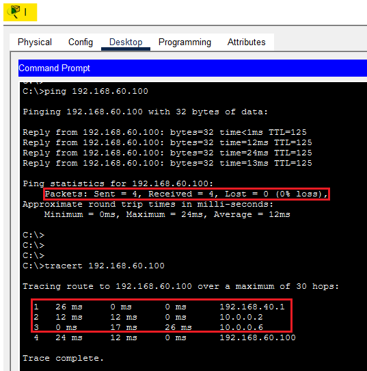

# 🚀 Laboratório de Roteamento Dinâmico (OSPF v2)

Este projeto demonstra a implementação de uma infraestrutura corporativa multi-setorial utilizando o protocolo de roteamento dinâmico **OSPF (Open Shortest Path First)** em Área Única (Area 0) para convergência automática de tabelas de rotas e alta escalabilidade.

---

## 🗺️ Topologia da Rede
<p align="center">
  
</p>

## 📁 Arquivos do Laboratório

Abaixo estão indexados a topologia executável do Cisco Packet Tracer e as configurações dos dispositivos (CLI) extraídas diretamente dos ativos:

* 💻 **Arquivo do Packet Tracer:** [Roteamento-Dinamico.pkt](src/Roteamento-Dinamico.pkt)
* 📄 **CLI - Roteador A (Router-A):** [Roteador-A.cfg](src/Roteador-A.cfg)
* 📄 **CLI - Roteador B (Router-B):** [Roteador-B.cfg](src/Roteador-B.cfg)
* 📄 **CLI - Roteador C (Router-C):** [Roteador-C.cfg](src/Roteador-C.cfg)

---

## 📈 Planejamento de Endereçamento IP (VLSM por Localidade)
O projeto utiliza três redes principais distintas, com escopos fatiados de forma cirúrgica utilizando Máscaras de Tamanho Variável (VLSM) para mitigar o desperdício de endereços:

### 🔗 Redes de Trânsito (Backbone Ponto a Ponto)
Os links que conectam os roteadores de borda entre si utilizam a máscara **`/30` (255.255.255.252)**. Esta configuração é o padrão absoluto da indústria para redes de trânsito ponto a ponto, pois libera exatamente 2 endereços IP válidos por enlace, eliminando qualquer desperdício de escopo IPv4 no backbone corporativo:
* **Link Roteador A ↔ Roteador B:** Rede `10.0.0.0/30` (IPs úteis: `.1` e `.2`)
* **Link Roteador B ↔ Roteador C:** Rede `10.0.0.4/30` (IPs úteis: `.5` e `.6`)

### Roteador "A" (esquerdo): Rede `192.168.40.0`

| Setor / VLAN | Hosts | Máscara / CIDR | Salto | Rede / Broadcast | Gateway | IPs Válidos (PCs) |
| :--- | :---: | :--- | :---: | :--- | :---: | :--- |
| **Setor Financeiro** - VLAN 10 | 50 | `255.255.255.192` (/26) | 64 | `.0` / `.63` | `.1` | `.2` até `.62` |
| **Setor Operacional** - VLAN 20 | 20 | `255.255.255.224` (/27) | 32 | `.64` / `.95` | `.65` | `.66` até `.94` |
| **Almoxarifado** - VLAN 30 | 10 | `255.255.255.240` (/28) | 16 | `.96` / `.111` | `.97` | `.98` até `.110` |

### Roteador "B" (meio): Rede `192.168.50.0`

| Setor / VLAN | Hosts | Máscara / CIDR | Salto | Rede / Broadcast | Gateway | IPs Válidos (PCs) |
| :--- | :---: | :--- | :---: | :--- | :---: | :--- |
| **Central Atend.** - VLAN 10 | 15 | `255.255.255.224` (/27) | 32 | `.0` / `.31` | `.1` | `.2` até `.30` |
| **Centro Distrib.** - VLAN 20 | 5 | `255.255.255.240` (/28) | 16 | `.32` / `.47` | `.33` | `.34` até `.46` |

### Roteador "C" (direito): Rede `192.168.60.0`

| Setor / VLAN | Hosts | Máscara / CIDR | Salto | Rede / Broadcast | Gateway | IPs Válidos (PCs) |
| :--- | :---: | :--- | :---: | :--- | :---: | :--- |
| **Setor Financeiro** - VLAN 10 | 50 | `255.255.255.192` (/26) | 64 | `.0` / `.63` | `.1` | `.2` até `.62` |
| **Setor Operacional** - VLAN 20 | 20 | `255.255.255.224` (/27) | 32 | `.64` / `.95` | `.65` | `.66` até `.94` |
| **Almoxarifado** - VLAN 30 | 10 | `255.255.255.240` (/28) | 16 | `.96` / `.111` | `.97` | `.98` até `.110` |

---

## 💻 Configurações na CLI (Processo OSPF & Máscaras Wildcard)

Diferente do roteamento estático, o OSPF calcula os caminhos dinamicamente. Para anunciar as redes locais e fechar as adjacências de vizinhança nas redes de trânsito, aplicamos o processo OSPF em Área Única associado ao cálculo da **Máscara Wildcard (Inversa)**.

### 🔌 1. Ativação do Gateway Inter-VLAN (Exemplo Roteador "A")
Comandos cruciais utilizados para ativar o entroncamento (*Router-on-a-Stick*) através do protocolo dot1Q:
```text
interface GigabitEthernet0/0.10
 encapsulation dot1Q 10
 ip address 192.168.40.1 255.255.255.192
interface GigabitEthernet0/0.20
 encapsulation dot1Q 20
 ip address 192.168.40.65 255.255.255.224
interface GigabitEthernet0/0.30
 encapsulation dot1Q 30
 ip address 192.168.40.97 255.255.255.240
```

### 🎛️ 2. Configuração de Trunking nos Switches (IEEE 802.1Q)
Para suportar as subinterfaces lógicas configuradas nos roteadores de borda, a porta de uplink do switch foi definida em modo tronco:
```text
interface GigabitEthernet0/1
 switchport mode trunk
```

### 🔄 3. Ativação do Protocolo OSPF v2

**No Roteador "A" (esquerdo):**
```text
router ospf 1
 log-adjacency-changes
 network 10.0.0.0 0.0.0.3 area 0
 network 192.168.40.0 0.0.0.63 area 0
 network 192.168.40.64 0.0.0.31 area 0
 network 192.168.40.96 0.0.0.15 area 0
```

**No Roteador "B" (meio):**
```text
router ospf 1
 log-adjacency-changes
 network 10.0.0.0 0.0.0.3 area 0
 network 10.0.0.4 0.0.0.3 area 0
 network 192.168.50.0 0.0.0.31 area 0
 network 192.168.50.32 0.0.0.15 area 0
```

**No Roteador "C" (direito):**
```text
router ospf 1
 log-adjacency-changes
 network 10.0.0.4 0.0.0.3 area 0
 network 192.168.60.0 0.0.0.63 area 0
 network 192.168.60.64 0.0.0.31 area 0
 network 192.168.60.96 0.0.0.15 area 0
```

* **Por que usar `log-adjacency-changes`?** Garante o envio de logs informativos para o terminal CLI sempre que ocorrerem mudanças de estado de adjacência com roteadores vizinhos, otimizando o monitoramento e troubleshooting do backbone.
* **Por que as máscaras usam a notação `0.0.0.X`?** O OSPF utiliza a Máscara Wildcard, que é o inverso matemático da máscara de sub-rede comum. Isso indica ao protocolo exatamente qual escopo de rede ele deve inspecionar e anunciar na Área 0 de forma automatizada.

---

## 📋 Auditoria e Adjacência do Protocolo

### 🤝 1. Tabela de Vizinhos OSPF (Router-B)
Abaixo está listada a tabela de vizinhança lida a partir do Roteador Central (B). O status **`FULL`** comprova que a sincronização da base de dados entre os ativos foi concluída com sucesso. Os papéis de **`DR`** (Designated Router/Líder) e **`BDR`** (Backup Designated Router/Vice) foram estabelecidos de forma automatizada para organizar o tráfego do protocolo no backbone:

<!-- Imagem reduzida centralizada -->
<p align="center">
  
</p>

<!-- Tabela invisível original que garante a centralização e o botão com borda -->
<table align="center" style="border: none !important; background: transparent !important; border-collapse: collapse;">
  <tr style="border: none !important; background: transparent !important;">
    <td style="border: none !important; background: transparent !important; text-align: center; padding: 0;">
      <details style="display: inline-block;">
        <summary style="cursor: pointer; list-style: none;">
          <code><strong>🔍 Clique aqui para aplicar ZOOM na imagem acima</strong></code>
        </summary>
        <br><br>
        <p align="center">
          
        </p>
      </details>
    </td>
  </tr>
</table>

### 🛣️ 2. Tabela de Roteamento Dinâmico (Router-A)
Abaixo está evidenciada a tabela de rotas interna do Router-A gerada via comando `show ip route`. É possível comprovar o sucesso da automação através das redes mapeadas com o prefixo **`O`** (OSPF), provando que o roteador aprendeu os blocos remotos dinamicamente, sem intervenção manual:

<!-- Imagem reduzida centralizada -->
<p align="center">
  
</p>

<!-- Tabela invisível original que garante a centralização e o botão com borda -->
<table align="center" style="border: none !important; background: transparent !important; border-collapse: collapse;">
  <tr style="border: none !important; background: transparent !important;">
    <td style="border: none !important; background: transparent !important; text-align: center; padding: 0;">
      <details style="display: inline-block;">
        <summary style="cursor: pointer; list-style: none;">
          <code><strong>🔍 Clique aqui para aplicar ZOOM na imagem acima</strong></code>
        </summary>
        <br><br>
        <p align="center">
          
        </p>
      </details>
    </td>
  </tr>
</table>

---

## 🧪 Validação e Testes de Conectividade

Para validar o processo de convergência automática do protocolo OSPF e garantir a alcançabilidade global das rotas de forma dinâmica, foi realizado um teste duplo de ICMP (Ping) e rastreamento lógico (Tracert) atravessando toda a topologia de borda.

### Escopo do Cenário de Teste:
* **Origem:** PC "I" (Setor Financeiro - Roteador A) | IP: `192.168.40.10`
* **Destino:** PC "P" (Almoxarifado - Roteador C) | IP: `192.168.60.100`
* **Convergência Dinâmica:** Os roteadores trocaram pacotes Hello e estabeleceram adjacência (vizinhança) em Area 0. O Roteador "A" aprendeu a rota para o bloco remoto de destino de forma totalmente automática através dos anúncios dinâmicos do OSPF, encaminhando os pacotes com sucesso através do backbone, sem qualquer mapeamento estático manual.

Abaixo, a evidência do terminal comprovando a conectividade com 0% de perda (Ping) junto à rota salto por salto mapeada perfeitamente até a extremidade da rede (Tracert):

<!-- Imagem reduzida centralizada -->
<p align="center">
  
</p>

<!-- Tabela invisível original que garante a centralização e o botão com borda -->
<table align="center" style="border: none !important; background: transparent !important; border-collapse: collapse;">
  <tr style="border: none !important; background: transparent !important;">
