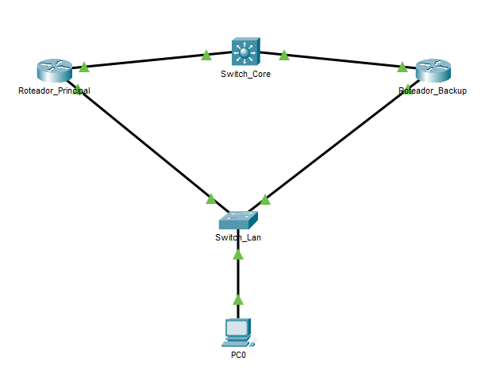
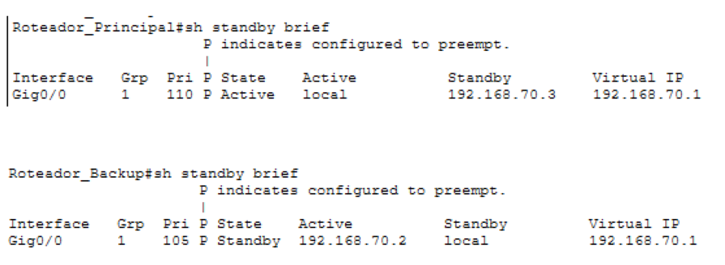
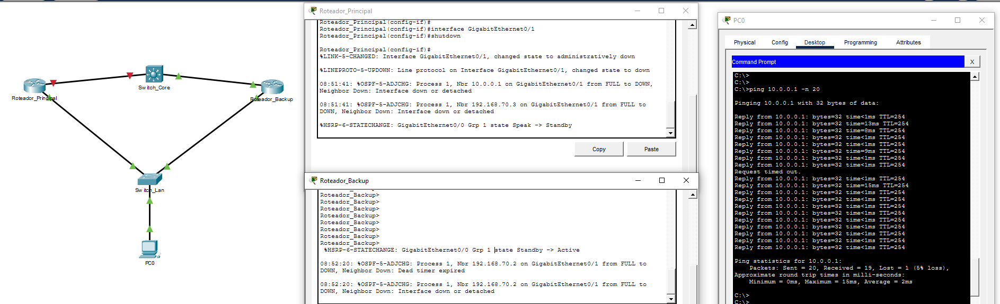
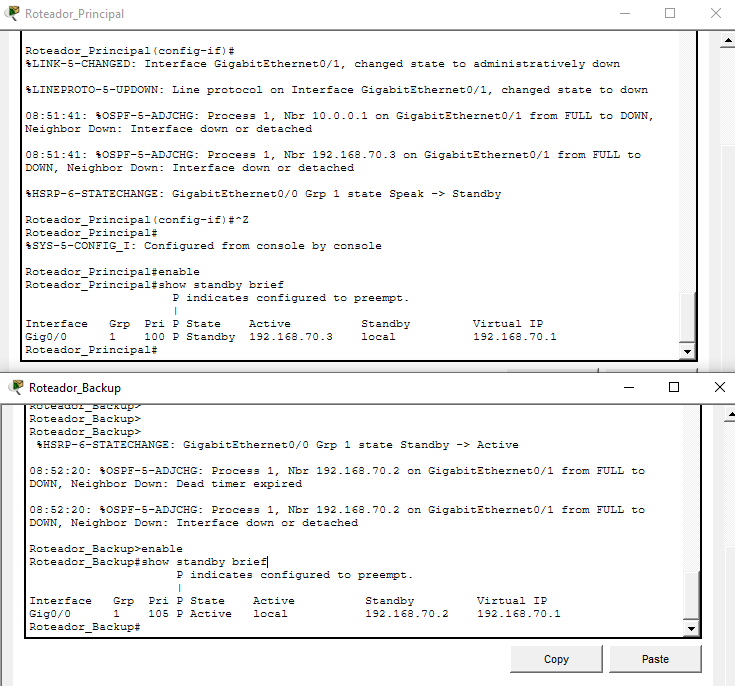
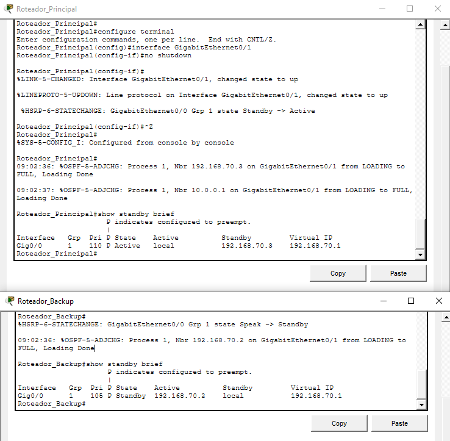
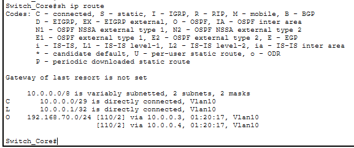

# 🚀 Laboratório de Alta Disponibilidade Corporativa (FHRP/HSRP + OSPF + Interface Tracking)

Este projeto demonstra a implementação de uma arquitetura de infraestrutura de rede resiliente e tolerante a falhas (Fault Tolerant), integrando o protocolo de redundância de primeiro salto **HSRP (Hot Standby Router Protocol)** com o protocolo de roteamento dinâmico **OSPF v2** e técnicas automáticas de rastreamento de interface (*Interface Tracking*).

---

## 🗺️ Topologia da Rede


---

## 📊 Design de Engenharia e Tabela de IPs

O cenário foi projetado para simular o backbone de uma borda corporativa espalhada em um segmento multiacesso na camada superior (WAN/Core) e conectada a uma LAN interna redundante na base.

### 🌐 Rede de Trânsito Superior / Backbone (OSPF Area 0)
* **Sub-rede física corporativa:** `10.0.0.0/29` (Máscara: `255.255.255.248`)
* **IP Switch_Core (Interface VLAN 10):** `10.0.0.1`
* **IP Roteador_Principal (Interface GigabitEthernet 0/1):** `10.0.0.3`
* **IP Roteador_Backup (Interface GigabitEthernet 0/1):** `10.0.0.4`

> 💡 **Nota de Escalabilidade:** Embora uma máscara `/30` fosse suficiente para conectar apenas dois roteadores, optou-se pela máscara `/29` para reservar 4 IPs adicionais. Isso segue boas práticas de engenharia, permitindo a futura integração de dispositivos como **Firewalls de borda**, **Servidores de Monitoramento (Zabbix/PRTG)** ou um **Roteador de Contingência** neste segmento, sem a necessidade de renumeração complexa da rede.

### 🖥️ Rede Nova / LAN Corporativa (HSRP Grupo 1)
* **Sub-rede física local:** `192.168.70.0/24` (Máscara: `255.255.255.0`)
* **IP Físico - Roteador_Principal (Interface GigabitEthernet 0/0):** `192.168.70.2`
* **IP Físico - Roteador_Backup (Interface GigabitEthernet 0/0):** `192.168.70.3`
* **IP Virtual Flutuante / Gateway Padrão dos PCs:** `192.168.70.1`

---

## ⚙️ Configurações Aplicadas via CLI

### 🛠️ 1. Ativos de Borda Corporativa (Gateway Ativo vs Standby)
O **Roteador_Principal** foi definido como o gateway prioritário (`priority 110`). Caso ele sofra uma queda de energia ou reinicie, o comando `preempt` garante que ele retome o papel de líder automaticamente assim que voltar a ficar online. O comando `standby track` foi aplicado **apenas no Principal**, pois é ele quem precisa "avisar" que está incapaz de encaminhar tráfego caso seu link de subida caia, rebaixando sua prioridade para que o Backup assuma.

```cisco
! Configuração no Roteador_Principal
interface GigabitEthernet0/0
ip address 192.168.70.2 255.255.255.0
standby 1 ip 192.168.70.1
standby 1 priority 110
standby 1 preempt
standby 1 track GigabitEthernet 0/1

interface GigabitEthernet0/1
ip address 10.0.0.3 255.255.255.248

router ospf 1
network 10.0.0.0 0.0.0.7 area 0
network 192.168.70.0 0.0.0.255 area 0
```

### 🛠️ 2. Gateway de Redundância / Standby (Roteador_Backup)
O **Roteador_Backup** foi configurado com a prioridade customizada de `105` para responder de forma cirúrgica às métricas de failover da rede local:

```cisco
! Configuração no Roteador_Backup
interface GigabitEthernet0/0
ip address 192.168.70.3 255.255.255.0
standby 1 ip 192.168.70.1
standby 1 priority 105
standby 1 preempt

interface GigabitEthernet0/1
ip address 10.0.0.4 255.255.255.248

router ospf 1
network 10.0.0.0 0.0.0.7 area 0
network 192.168.70.0 0.0.0.255 area 0
```

### 🛠️ 3. Ativo de Distribuição Superior (Switch_Core - Modelo 3650)
Configuração do processo OSPF no ativo de topo por meio de Interface VLAN lógica para garantir o trânsito multiacesso sem a ocorrência de erros de overlap nas portas físicas:

```cisco
! Configuração no Switch_Core
ip routing

interface vlan 10
ip address 10.0.0.1 255.255.255.248
no shutdown
exit

interface range GigabitEthernet1/0/1 - 2
switchport mode access
switchport access vlan 10
exit

router ospf 1
log-adjacency-changes
network 10.0.0.0 0.0.0.7 area 0
```

### 🧠 4. Mecanismo de Inteligência (Interface Tracking)
O grande diferencial técnico deste laboratório está inserido na linha `standby 1 track GigabitEthernet 0/1` inserida no Roteador_Principal. Este comando instrui o HSRP a monitorar continuamente o estado físico (*Line Protocol*) da porta de Uplink (`G0/1`).

* **Funcionamento:** Se a interface monitorada cair (estado `down`), o roteador decrementa automaticamente **10 pontos** de sua prioridade HSRP (padrão do IOS).
* **Resultado:** A prioridade cai de **110 para 100**. Como o **Roteador_Backup** mantém a prioridade estável em **105**, ele detecta que agora possui a maior prioridade e assume o tráfego da LAN imediatamente.

---

## 🧪 Validação Prática e Linha do Tempo do Ambiente (Failover & Preempção)

O laboratório de Alta Disponibilidade foi validado simulando um cenário real de falha física através do desligamento da interface do gateway principal. Todo o comportamento da rede foi registrado de forma síncrona na topologia:

1. **Estado Inicial (Normalidade):** O `Roteador_Principal` assume a liderança como `Active` (Prioridade 110) e o `Roteador_Backup` fica em modo de espera como `Standby` (Prioridade 105). Ambos respondem pelo IP Virtual do Gateway (`192.168.70.1`).
2. **O Evento de Falha (Queda do Link):** Ao aplicar o comando `shutdown` na interface ativa, o tráfego em tempo real sofre uma perda imperceptível de apenas 1 pacote (conforme evidenciado pela linha de *Request timed out* no prompt de comando do PC0).
3. **Mecanismo de Failover (Inversão de Papéis):** O `Roteador_Backup` detecta a ausência de mensagens de Hello e altera instantaneamente o seu estado de `Standby -> Active`, assumindo o encaminhamento de pacotes da LAN de forma transparente para o usuário final.
4. **Resiliência e Preempção (Retorno à Normalidade):** Ao aplicar o comando `no shutdown` na interface do `Roteador_Principal`, a adjacência OSPF é restabelecida (`LOADING to FULL`). Devido à configuração do comando `preempt`, o roteador principal reivindica o seu posto de líder na infraestrutura corporativa, alterando de forma automatizada o seu estado de volta para `Standby -> Active`.

---

## 📸 Evidências Técnicas do Laboratório

Para conferência analítica da integridade do projeto, abaixo estão centralizadas as telas coletadas durante as fases do teste de resiliência:

### 🏙️ 1. Cenário Inicial Estável (HSRP Ativo e Standby Operando)
<p align="center">
  
</p>

### ⚡ 2. Linha do Tempo da Falha e Transição de Fluxo (Failover no Prompt do PC0)
<p align="center">
  
</p>

### 📉 3. Mecanismo de Failover (Inversão de Papéis com Prioridade 100)
<p align="center">
  
</p>

### 🔄 4. Restabelecimento do Link e Preempção Automática (Retorno a 110)
<p align="center">
  
</p>

### 🧠 5. Tabela de Rotas no Core (Equal-Cost Multi-Path - OSPF Ativo)
Abaixo está a validação da tabela de roteamento no `Switch_Core`. A presença da letra **`O`** comprova que o roteamento dinâmico OSPF aprendeu a rede interna de forma automatizada através de dois caminhos de custo idêntico (redundância de Camada 3 ativa):
<p align="center">
  
</p>

---

## 🛠️ Considerações Técnicas e Limitações do Simulador

### 🔬 Monitoramento Físico vs. Lógico (IP SLA)
É crucial distinguir o tipo de falha monitorada neste laboratório:

* **O que este projeto faz:** O comando `track` monitora o **estado físico da interface** (Layer 1/2). Se o cabo for desconectado ou a porta desligada (`shutdown`), o failover ocorre com sucesso.
* **O que este projeto NÃO faz (Limitação do Packet Tracer):** O protocolo não detecta falhas **lógicas** de roteamento (ex: se a interface estiver "up", mas o provedor de internet estiver fora do ar ou houver um erro de roteamento remoto).
* **Solução em Produção:** Em um ambiente corporativo real, esta configuração deve ser evoluída com **IP SLA (Service Level Agreement)**. O IP SLA enviaria pings contínuos para um IP remoto confiável; se os pings falhassem (mesmo com a interface física ativa), o IP SLA avisaria o HSRP para realizar o failover. Esta implementação não foi possível neste simulador devido à limitação de comandos avançados no Cisco Packet Tracer.

## 🔄 Próximos Passos: Hardening e Segurança de Roteamento

Neste estágio, a rede está redundante na LAN e roteando dinamicamente via OSPF na WAN. Contudo, o protocolo OSPF está operando sem autenticação, o que permitiria que um roteador malicioso fisicamente conectado injetasse rotas falsas e interceptasse o tráfego da empresa.

Para mitigar essa vulnerabilidade na Camada 3 e blindar o backbone corporativo, acesse o próximo projeto focado em segurança:

👉 **[Acessar Laboratório 04: Segurança OSPF (MD5)](../04-seguranca-ospf-md5/)**
