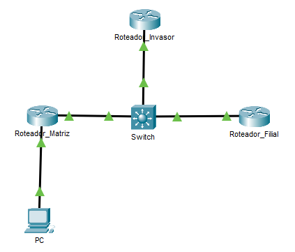
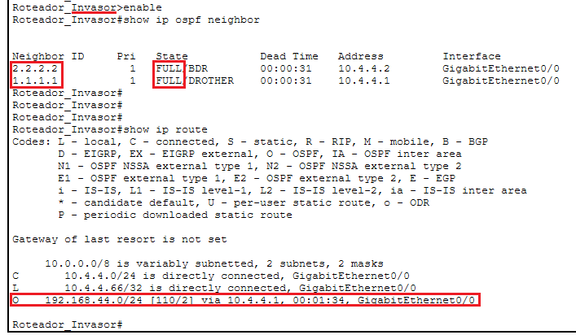
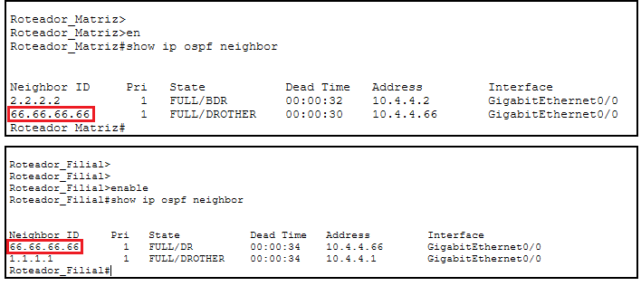
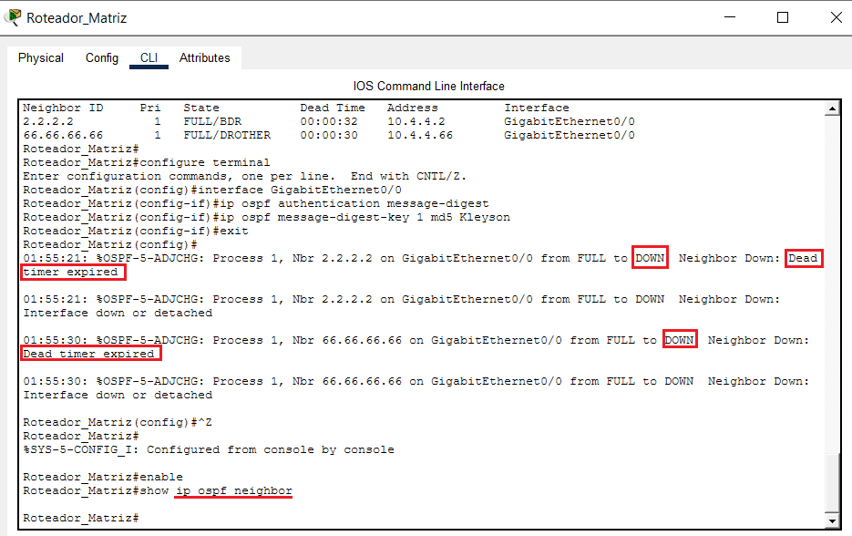
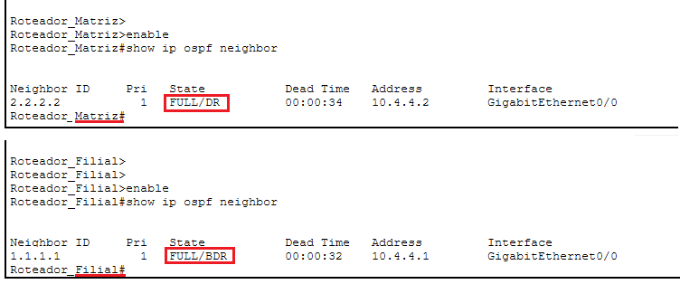
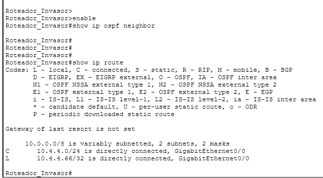

# 🛡️ Projeto 04: Hardening de Roteamento Dinâmico (Segurança OSPF com MD5)

## 📌 Cenário e Objetivo do Laboratório
Este projeto demonstra a vulnerabilidade do protocolo OSPF v2 em sua configuração padrão de fábrica e a implementação de segurança através de Hardening com autenticação criptografada MD5. O cenário simula dois roteadores legítimos interligados por um Switch Gigabit Catalyst 3650, sofrendo uma tentativa de infiltração e injeção de rotas falsas por um dispositivo atacante conectado ao mesmo barramento físico.

---

## 📐 Topologia da Rede e Endereçamento IP

Abaixo está o design físico e lógico do ambiente de trânsito multiacesso (WAN) e da rede local protegida (LAN):

<p align="center">
  
</p>

### 📊 Tabela de Endereçamento:
*   **Rede de Trânsito WAN:** `10.4.4.0/24` (Matriz: `.1` | Filial: `.2` | Invasor: `.66`)
*   **Rede Interna LAN:** `192.168.44.0/24` (Gateway Matriz: `.1` | PC_Matriz: `.10`)

---
## 📁 Arquivos do Laboratório

Abaixo estão indexados a topologia executável do Cisco Packet Tracer e as configurações dos dispositivos (CLI) extraídas diretamente dos ativos após a mitigação da vulnerabilidade:

* 💻 **Arquivo do Packet Tracer:** [Seguranca-ospf-md5.pkt](src/Seguranca-ospf-md5.pkt)
* 📄 **CLI - Roteador Matriz:** [Roteador-Matriz.cfg](src/Roteador-Matriz.cfg)
* 📄 **CLI - Roteador Filial:** [Roteador-Filial.cfg](src/Roteador-Filial.cfg)
* 📄 **CLI - Roteador Invasor:** [Roteador-Invasor.cfg](src/Roteador-Invasor.cfg)

---

## 🐱‍👤 O Cenário de Vulnerabilidade (Antes do Hardening)

Sem segurança ativa, o protocolo OSPF aceita adjacências de qualquer dispositivo que envie pacotes do tipo *Hello* correspondentes. O atacante se infiltra na rede, estabelece vizinhança e rouba a tabela de rotas internas da empresa.

### 1. Evidência do Ataque no Roteador_Invasor:
Abaixo, comprova-se o invasor com vizinhança em estado `FULL` e a rota interna `192.168.44.0/24` injetada em sua tabela lógica:

<!-- Imagem reduzida centralizada -->
<p align="center">
  
</p>

<!-- Tabela invisível original que garante a centralização e o botão com borda -->
<table align="center" style="border: none !important; background: transparent !important; border-collapse: collapse;">
  <tr style="border: none !important; background: transparent !important;">
    <td style="border: none !important; background: transparent !important; text-align: center; padding: 0;">
      <details style="display: inline-block;">
        <summary style="cursor: pointer; list-style: none;">
          <code><strong>🔍 Clique aqui para aplicar ZOOM na imagem acima</strong></code>
        </summary>
        <br><br>
        <p align="center">
          
        </p>
      </details>
    </td>
  </tr>
</table>

### 2. Visão da Infraestrutura Corporativa Comprometida:
Tanto a Matriz quanto a Filial aceitam o vizinho malicioso (`66.66.66.66`) sem nenhuma restrição:

<!-- Imagem reduzida centralizada -->
<p align="center">
  
</p>

<!-- Tabela invisível original que garante a centralização e o botão com borda -->
<table align="center" style="border: none !important; background: transparent !important; border-collapse: collapse;">
  <tr style="border: none !important; background: transparent !important;">
    <td style="border: none !important; background: transparent !important; text-align: center; padding: 0;">
      <details style="display: inline-block;">
        <summary style="cursor: pointer; list-style: none;">
          <code><strong>🔍 Clique aqui para aplicar ZOOM na imagem acima</strong></code>
        </summary>
        <br><br>
        <p align="center">
          
        </p>
      </details>
    </td>
  </tr>
</table>


---

## 🛡️ Implementação do Hardening (Criptografia MD5)

Para mitigar a ameaça, aplicamos a autenticação por Message Digest (MD5) diretamente na interface de trânsito dos roteadores legítimos (Roteador_Matriz e Roteador_Filial). 

```ios
! Comando aplicado na Interface GigabitEthernet0/0 dos roteadores legítimos (Roteador_Matriz e Roteador_Filial)
ip ospf authentication message-digest
ip ospf message-digest-key 1 md5 kleyson
```

### O Efeito Imediato do Hardening na Matriz:
Assim que o comando é inserido, o roteador exige pacotes assinados digitalmente. Como os vizinhos não possuem a chave, a vizinhança é ejetada imediatamente por estouro de temporizador (*Dead timer expired*):

<!-- Imagem reduzida centralizada -->
<p align="center">
  
</p>

<!-- Tabela invisível original que garante a centralização e o botão com borda -->
<table align="center" style="border: none !important; background: transparent !important; border-collapse: collapse;">
  <tr style="border: none !important; background: transparent !important;">
    <td style="border: none !important; background: transparent !important; text-align: center; padding: 0;">
      <details style="display: inline-block;">
        <summary style="cursor: pointer; list-style: none;">
          <code><strong>🔍 Clique aqui para aplicar ZOOM na imagem acima</strong></code>
        </summary>
        <br><br>
        <p align="center">
          
        </p>
      </details>
    </td>
  </tr>
</table>

> 💡 *Dica de Diagnóstico: Em ambientes de produção, o comando `debug ip ospf adj` pode ser utilizado em modo de privilégio para analisar erros de incompatibilidade de chaves em tempo real.*

---

## 🏆 Validação Final do Ambiente Seguro

### 1. Reestabelecimento do Link Confiável
Após padronizar a mesma chave criptográfica na Filial, os roteadores legítimos (Roteador_Matriz e Roteador_Filial) restabelecem a adjacência OSPF em modo seguro (estado FULL). Como evidenciado abaixo, o Roteador_Invasor foi completamente ejetado e não aparece mais na tabela de vizinhos, bloqueado permanentemente por não possuir a senha: 

<!-- Imagem reduzida centralizada -->
<p align="center">
  
</p>

<!-- Tabela invisível original que garante a centralização e o botão com borda -->
<table align="center" style="border: none !important; background: transparent !important; border-collapse: collapse;">
  <tr style="border: none !important; background: transparent !important;">
    <td style="border: none !important; background: transparent !important; text-align: center; padding: 0;">
      <details style="display: inline-block;">
        <summary style="cursor: pointer; list-style: none;">
          <code><strong>🔍 Clique aqui para aplicar ZOOM na imagem acima</strong></code>
        </summary>
        <br><br>
        <p align="center">
          
        </p>
      </details>
    </td>
  </tr>
</table>

### 2. Isolamento e Cegueira Total do Atacante
Abaixo, a prova de sucesso da segurança: o `Roteador_Invasor` perde todos os vizinhos OSPF e a tabela de rotas perde o conhecimento sobre a rede privada da empresa (a linha com a rota **O** sumiu completamente):

<!-- Imagem reduzida centralizada -->
<p align="center">
  
</p>

<!-- Tabela invisível original que garante a centralização e o botão com borda -->
<table align="center" style="border: none !important; background: transparent !important; border-collapse: collapse;">
  <tr style="border: none !important; background: transparent !important;">
    <td style="border: none !important; background: transparent !important; text-align: center; padding: 0;">
      <details style="display: inline-block;">
        <summary style="cursor: pointer; list-style: none;">
          <code><strong>🔍 Clique aqui para aplicar ZOOM na imagem acima</strong></code>
        </summary>
        <br><br>
        <p align="center">
          
        </p>
      </details>
    </td>
  </tr>
</table>

---

## 🏁 Conclusão e Próximos Passos

A implementação do Hardening OSPF com MD5 garantiu a integridade do plano de controle e da tabela de rotas da WAN corporativa.

### ➡️ Próximos Passos: 🛡️ Segurança de Camada 2

Agora que o trânsito entre roteadores está criptografado e seguro, o próximo risco crítico a mitigar são os ataques internos vindos de dentro da rede local na Camada 2 (Enlace), como usuários maliciosos clonando servidores DHCP ou estourando a tabela MAC das portas dos switches corporativos. Para analisar a solução com DHCP Snooping e Port Security, acesse o próximo **laboratório** focado em segurança:

👉 **[Acessar Laboratório 05: Segurança de Switching (Port Security & DHCP Snooping)](../05-seguranca-switching/)**
