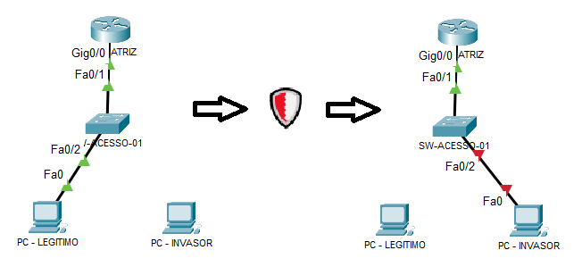
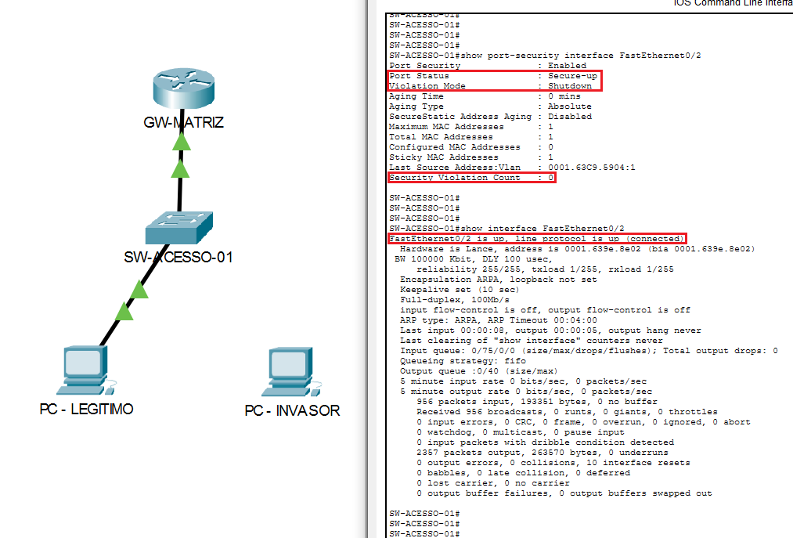
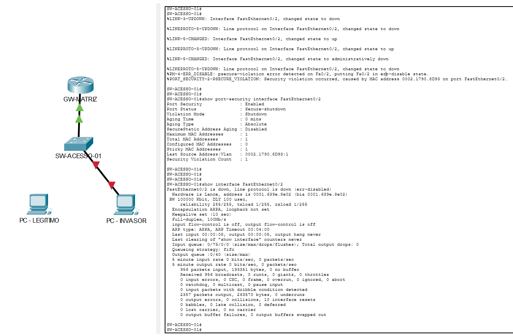

# Laboratório 05: Segurança de Ativos em Camada 2 (Port Security & DHCP Snooping)

## 📌 Cenário e Objetivo do Laboratório

Este laboratório apresenta a implementação prática de mecanismos de segurança de Camada 2 (Enlace) em switches Cisco corporativos. O objetivo principal é blindar a infraestrutura de rede local contra ameaças de intrusão e engenharia social através dos recursos de **Port Security (Sticky Mode)** e **DHCP Snooping (Trusted/Untrusted Ports)**, mitigando vetores críticos como a clonagem ou estouro de endereços MAC (MAC Spoofing/Flooding) e a introdução de servidores DHCP maliciosos (Rogue DHCP) na LAN corporativa.

O cenário simula uma situação de ataque onde um invasor desconecta o terminal de um funcionário homologado para tentar ganhar acesso à rede através da mesma tomada física da parede, acionando os gatilhos automatizados de defesa do Switch.

---

## 🗺️ 1. Topologia da Rede e Fluxo de Segurança

Abaixo está o mapeamento visual do comportamento da infraestrutura de rede durante a execução dos testes, evidenciando o contraste entre o tráfego permitido e o bloqueio imediato da ameaça utilizando a estratégia de cabo único na interface **`Fa0/2`**:

<p align="center">
  
</p>

## 📁 2. Arquivos do Laboratório

Abaixo estão indexados a topologia executável do Cisco Packet Tracer e as configurações dos dispositivos (CLI) extraídas diretamente dos ativos após a mitigação da vulnerabilidade:

* 💻 **Arquivo do Packet Tracer:** [seguranca-switching.pkt](scr/Seguranca-switching.pkt)
* 📄 **CLI - Roteador Gateway Matriz (GW-MATRIZ):** [GW-MATRIZ.cfg](scr/GW-MATRIZ.cfg)
* 📄 **CLI - Switch de Acesso (SW-ACESSO-01):** [SW-ACESSO-01.cfg](scr/SW-ACESSO-01.cfg)

---

## 🚀 Principais Comandos de Configuração

## ⚙️ Configurações Aplicadas via CLI

Abaixo estão destacados os papéis de engenharia de cada elemento da infraestrutura e seus respectivos blocos de comandos fundamentais organizados em uma matriz comparativa:

* 🛡️ **1. Servidor DHCP Legítimo (GW-MATRIZ):** Criação do pool de endereçamento IPv4 corporativo para distribuição dinâmica de parâmetros de rede.
* 🛡️ **2. Blindagem contra Servidores Rogue (DHCP Snooping):** Ativação global do monitoramento de pacotes DHCP e definição de portas confiáveis (Trusted) para evitar ataques de *Man-in-the-Middle*, com a remoção da opção 82 para compatibilidade de simulação.
* 🛡️ **3. Proteção de Portas de Acesso (Port Security):** Configuração restrita na interface do usuário final para memorizar dinamicamente o primeiro endereço MAC conectado (Sticky) e aplicar o desligamento imediato (Shutdown) por hardware em caso de divergência.

Segue as configurações essenciais de cada ativo de infraestrutura foram organizadas em matriz lado a lado:

<table width="100%" style="border: none !important; background: transparent !important; border-collapse: collapse; table-layout: fixed; margin: 0; padding: 0;">
  <tr style="border: none !important; background: transparent !important;">
    <!-- COLUNA 1: SERVIDOR DHCP LEGÍTIMO -->
    <td valign="top" width="33%" style="border: none !important; background: transparent !important; padding: 4px;">
      <strong>🚀 1. Servidor DHCP Legítimo</strong>
      <br><br>
<pre style="font-size: 11px !important; margin: 0 !important; padding: 8px !important;">
interface GigabitEthernet0/0/0
 ip address 192.168.50.1 255.255.255.0
 no shutdown
exit
ip dhcp pool LAN_KLEYSON
 network 192.168.50.0 255.255.255.0
 default-router 192.168.50.1
 dns-server 8.8.8.8
</pre>
    </td>
    <!-- COLUNA 2: DHCP SNOOPING -->
    <td valign="top" width="33%" style="border: none !important; background: transparent !important; padding: 4px;">
      <strong>🚀 2. DHCP Snooping</strong>
      <br><br>
<pre style="font-size: 11px !important; margin: 0 !important; padding: 8px !important;">
ip dhcp snooping
ip dhcp snooping vlan 1
no ip dhcp snooping information option
!
! Interface conectada ao DHCP Real
interface FastEthernet0/1
 ip dhcp snooping trust
</pre>
    </td>
    <!-- COLUNA 3: PORT SECURITY -->
    <td valign="top" width="33%" style="border: none !important; background: transparent !important; padding: 4px;">
      <strong>🚀 3. Port Security</strong>
      <br><br>
<pre style="font-size: 11px !important; margin: 0 !important; padding: 8px !important;">
interface FastEthernet0/2
 switchport mode access
 switchport port-security
 switchport port-security maximum 1
 switchport port-security mac-address sticky
 switchport port-security violation shutdown
</pre>
    </td>
  </tr>
</table>

---

## 🧪 Validação dos Testes e Resultados

### Fase 1: Estado Saudável da Rede (Usuário Homologado)
Ao conectar o terminal `PC - LEGITIMO` na interface `FastEthernet0/2`, o Switch intercepta a comunicação através do DHCP Snooping, popula as tabelas dinâmicas e grava de forma persistente o endereço físico legítimo através do recurso `Sticky`.
*   **Comandos de Auditoria:** `show port-security interface FastEthernet0/2` e `show interface FastEthernet0/2`.
*   **Status Obtido:** Porta operacional em estado saudável (`Secure-up`), tráfego de dados totalmente permitido e link ativo (`connected`).

### Estado Saudável - Usuário Autorizado:

<!-- Imagem reduzida centralizada -->
<p align="center">
  
</p>

<!-- Tabela invisível original que garante a centralização e o botão com borda -->
<table align="center" style="border: none !important; background: transparent !important; border-collapse: collapse;">
  <tr style="border: none !important; background: transparent !important;">
    <td style="border: none !important; background: transparent !important; text-align: center; padding: 0;">
      <details style="display: inline-block;">
        <summary style="cursor: pointer; list-style: none;">
          <code><strong>🔍 Clique aqui para aplicar ZOOM na imagem acima</strong></code>
        </summary>
        <br><br>
        <p align="center">
          
        </p>
      </details>
    </td>
  </tr>
</table>

### Fase 2: Flagrante de Ataque e Bloqueio de Intruso (`err-disabled`)
Para simular a ameaça, o cabo da interface `FastEthernet0/2` foi desconectado do usuário legítimo e inserido no terminal `PC - INVASOR`. No momento em que o intruso tentou gerar o primeiro frame de dados na rede forçando um pedido de IP via `ipconfig /renew`, os mecanismos de defesa agiram instantaneamente:
*   **Mecanismo de Defesa:** O Switch identificou que o endereço MAC de origem não correspondia ao MAC autorizado no histórico `Sticky`.
*   **Status Obtido:** A política de violação executou o congelamento imediato da porta por hardware. O status foi alterado para **`Secure-shutdown`** e a interface entrou em modo **`(err-disabled)`**, cortando totalmente a conectividade do invasor e gerando alertas automáticos nos logs do sistema (Syslog).

### Bloqueio do Invasor - Err-Disabled:

<!-- Imagem reduzida centralizada -->
<p align="center">
  
</p>

<!-- Tabela invisível original que garante a centralização e o botão com borda -->
<table align="center" style="border: none !important; background: transparent !important; border-collapse: collapse;">
  <tr style="border: none !important; background: transparent !important;">
    <td style="border: none !important; background: transparent !important; text-align: center; padding: 0;">
      <details style="display: inline-block;">
        <summary style="cursor: pointer; list-style: none;">
          <code><strong>🔍 Clique aqui para aplicar ZOOM na imagem acima</strong></code>
        </summary>
        <br><br>
        <p align="center">
          
        </p>
      </details>
    </td>
  </tr>
</table>

---

### 🔄 Procedimento de Recuperação e Normalização

Em um cenário real de engenharia de redes, após a remoção física da ameaça e contenção do incidente pela equipe de segurança, a porta afetada precisa ser reativada administrativamente através da CLI do Switch seguindo a ordem correta:

```ios
interface FastEthernet0/2
 shutdown      ! Limpa o estado latente de erro (err-disable)
 no shutdown   ! Restabelece a energia física e o tráfego lógico da porta
```

> 💡 **Nota de Mercado & Evolução Tecnológica:**  
> Embora o *Port Security* estático (modo *Sticky*) seja altamente eficiente e amplamente empregado na atualidade para proteger ativos fixos críticos — tais como **servidores em data centers, câmeras de monitoramento (CFTV) e terminais de autoatendimento (caixas eletrônicos)** —, o mercado corporativo de grande porte adota uma abordagem dinâmica para portas de usuários comuns.  
> 
> Para evitar os alarmes falsos gerados pela alta rotatividade de notebooks nas mesas de trabalho, a indústria moderna utiliza o padrão **IEEE 802.1X (Network Access Control)** integrado a servidores centrais de autenticação (como *Cisco ISE* ou *Aruba ClearPass*). Nesse modelo avançado, a porta do switch nasce bloqueada por padrão e o dispositivo só obtém acesso à rede corporativa após validar com sucesso um certificado digital ou credenciais corporativas válidas, mitigando o ataque na origem sem a necessidade de intervenção manual do administrador.

